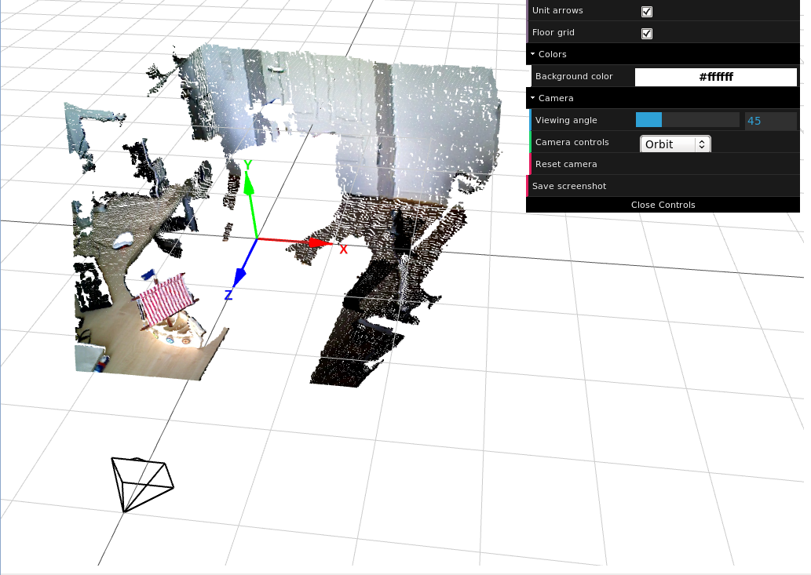

web3dviewer
===========

3D visualization for point clouds and meshes, using ThreeJS and WebGL.

Any libraries provided within this codebase are under MIT or Apache 2.0 license.

Installation
------------

Clone this repository and open 'web3dviewer.html' in your (WebGL-enabled) browser.

View live example: http://lmb.informatik.uni-freiburg.de/people/mayern/web3dviewer/web3dviewer

